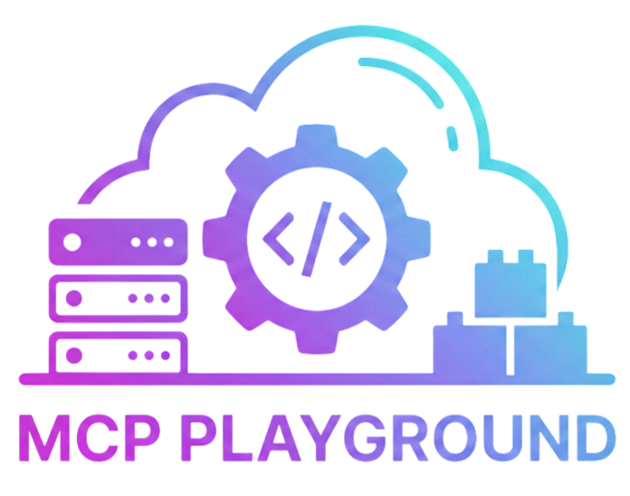

  

<h1 align="center">MCP Playground</h1>

  <strong>Build, test, and share Model Context Protocol (MCP) servers in your browser</strong>

  <a href="#-features">Features</a> •
  <a href="#-demo">Demo</a> •
  <a href="#-quick-start">Quick Start</a> •
  <a href="#-documentation">Documentation</a> •
  <a href="#-contributing">Contributing</a>

---

## 🎯 What is MCP Playground?

MCP Playground is a **free, open-source, browser-based development environment** for building and testing [Model Context Protocol (MCP)](https://modelcontextprotocol.io) servers. No installation required — just open your browser and start coding!

Perfect for:
- 📚 **Learning MCP** — Experiment without any local setup
- 💡 **Rapid Prototyping** — Test ideas before implementing in production
- 👩‍🏫 **Teaching & Workshops** — Share interactive examples with students
- 📝 **Documentation** — Create live, runnable code examples

## ✨ Features

| Feature | Description |
|---------|-------------|
| 🐍 **Python in Browser** | Full Python 3.11 runtime via Pyodide — no installation needed |
| ⚡ **FastMCP Support** | Write servers using the simple FastMCP decorator syntax |
| 💻 **Monaco Editor** | VS Code-like editing with syntax highlighting & autocomplete |
| 🧪 **Live Testing** | Test tools, resources, and prompts in real-time |
| 🤖 **Mock AI Chat** | Simulate AI assistant interactions with your MCP server |
| 🌐 **Live API Calls** | Templates with real external API integrations (weather, GitHub) |
| 📦 **Ready Templates** | Pre-built examples for common patterns |
| 🔍 **Tool Inspector** | Visualize tools, resources, and prompts with their schemas |
| 📊 **Console Output** | Real-time logs and debugging |
| 📥 **Export Code** | Download your server for production use |
| 🔗 **Share via URL** | Share your code with a single link |

## 🚀 Demo

**Live Demo:** [https://mcpplayground.com](https://mcpplayground.com)

## 📦 Quick Start

### Option 1: Use Online (Recommended)

Just visit [https://mcpplayground.com](https://mcpplayground.com) and start coding!

### Option 2: Run Locally

\`\`\`bash
# Clone the repository
git clone https://github.com/YOUR_USERNAME/mcp-playground.git
cd mcp-playground

# Install dependencies
npm install

# Start development server
npm run dev
\`\`\`

Open [http://localhost:3000](http://localhost:3000) in your browser.

### Option 3: Deploy Your Own

## 📖 How It Works

1. **Write Code** — Use the Monaco editor with Python syntax highlighting
2. **Run Server** — Pyodide executes your Python code in the browser
3. **Extract Tools** — The system parses your FastMCP decorators
4. **Test Tools** — Execute tools with the testing panel or mock AI chat
5. **View Results** — See outputs, logs, and debug information

## 📚 Templates

| Template | Description | Features |
|----------|-------------|----------|
| 🌟 **Hello World** | Basic introduction | Tools, Resources, Prompts |
| 🌤️ **Weather API (Live)** | Real weather data | External API calls, Geocoding |
| 🐙 **GitHub API** | Repository info | REST API integration |
| ✅ **Todo List (SQLite)** | Task management | SQLite database |
| 🧮 **Calculator** | Math operations | Multiple tools |
| 📊 **Data Analysis** | Statistical analysis | Complex computations |
| 📝 **Text Processor** | Text utilities | String manipulation |

## 🔧 Example: Creating an MCP Server

\`\`\`python
from mcp.server.fastmcp import FastMCP

# Create server
mcp = FastMCP("My Server")

# Define a tool
@mcp.tool()
def greet(name: str) -> str:
    """Greet someone by name.
    
    Args:
        name: The person's name to greet
    """
    return f"Hello, {name}! Welcome to MCP!"

# Define a resource
@mcp.resource("info://about")
def get_about() -> str:
    """Get information about this server."""
    return "This is my awesome MCP server!"

# Define a prompt
@mcp.prompt()
def welcome_prompt(user: str) -> str:
    """Generate a welcome message prompt."""
    return f"Please welcome {user} to our service."
\`\`\`

## 🛠️ Tech Stack

- **Framework:** [Nuxt 4](https://nuxt.com) + [Vue 3](https://vuejs.org)
- **UI Components:** [Nuxt UI](https://ui.nuxt.com) (TailwindCSS)
- **Editor:** [Monaco Editor](https://microsoft.github.io/monaco-editor/)
- **Python Runtime:** [Pyodide](https://pyodide.org) (Python 3.11 in WebAssembly)
- **MCP:** [FastMCP](https://github.com/jlowin/fastmcp) syntax support

## 🤝 Contributing

We welcome contributions! Here's how you can help:

- 🐛 **Report Bugs** — Open an issue
- 💡 **Suggest Features** — Request a feature
- 📝 **Improve Docs** — Help make our documentation better
- 🔧 **Submit PRs** — Fix bugs or add new features
- ⭐ **Star the Repo** — Show your support!

### Development Setup

\`\`\`bash
# Fork and clone
git clone https://github.com/YOUR_USERNAME/mcp-playground.git
cd mcp-playground

# Install dependencies
npm install

# Start dev server
npm run dev

# Build for production
npm run build
\`\`\`

### Project Structure

\`\`\`
mcp-playground/
├── pages/              # Nuxt pages (routes)
│   ├── index.vue       # Landing page
│   ├── editor.vue      # Main playground editor
│   ├── docs.vue        # Documentation
│   └── ...
├── components/         # Vue components
├── composables/        # Vue composables
│   ├── usePyodide.ts   # Pyodide integration
│   └── useMCPServer.ts # MCP server logic
├── utils/              # Utilities
│   └── templates.ts    # Code templates
└── public/             # Static assets
    └── logo.png        # Logo
\`\`\`

## 📄 License

This project is licensed under the **MIT License** — see the [LICENSE](LICENSE) file for details.

## 🔗 Resources

- 📖 [MCP Documentation](https://modelcontextprotocol.io)
- 🐍 [MCP Python SDK](https://github.com/modelcontextprotocol/python-sdk)
- ⚡ [FastMCP](https://github.com/jlowin/fastmcp)
- 🐙 [MCP GitHub](https://github.com/modelcontextprotocol)

## 💖 Acknowledgments

- [Anthropic](https://anthropic.com) for creating the Model Context Protocol
- [Pyodide](https://pyodide.org) team for Python in the browser
- [FastMCP](https://github.com/jlowin/fastmcp) for the elegant decorator syntax

---

  Built with ❤️ for the MCP community

  ⭐ Star us on GitHub if you find this useful!

